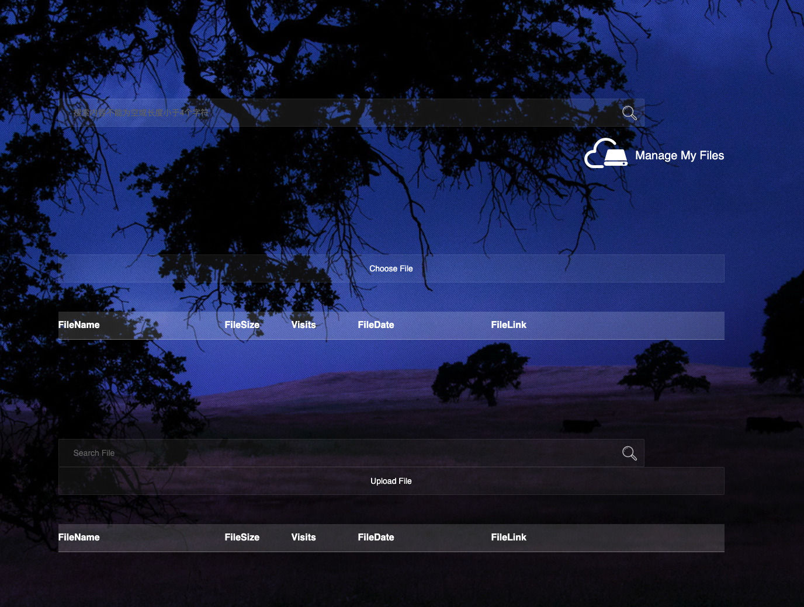

# File sharing system

## Description

This is a simple file sharing system. It allows users to upload files and share them with other users. It also allows users to download files shared by other users. It's designed by using __Django__ framework and __Python__.

## Installation

* Install Django 3.2.7

`sudo pip3 install pip -U`

`sudo pip3 install django==3.2.7`

* Install mysqlclient
  
`sudo apt update `

`sudo apt install libmysqlclient-dev`

`sudo pip3 install mysqlclient`

* Run the Project
  
```
1.
cd myproject
python3 manage.py startapp share

2.
# Create the database myproject and set the encoding format to UTF-8:

sudo service mysql start
mysql -uroot -e 'CREATE SCHEMA myproject CHARSET = UTF8'

3.
python3 manage.py runserver 0:8080
```

## Web Pages

